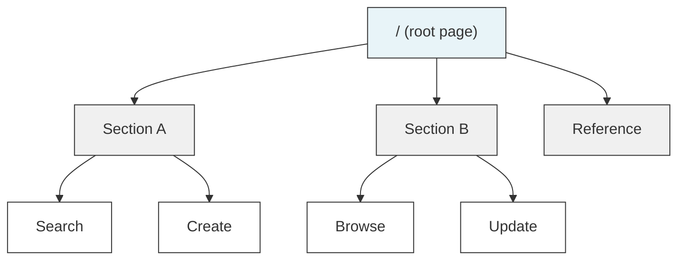
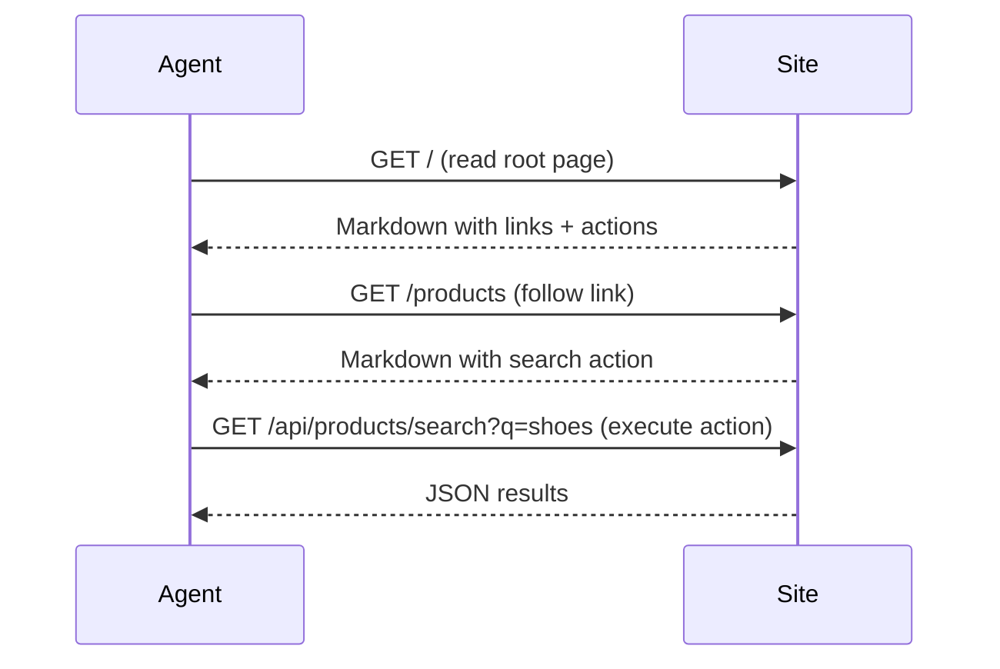
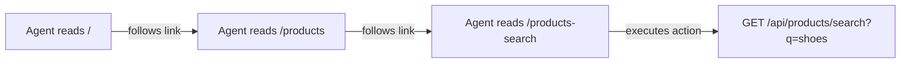

# MDH (Markdown Hypertext)

A spec for building websites that AI agents can read and use. Markdown pages, YAML frontmatter, plain HTTP.

## The problem

Agents interacting with the web today don't have great options. HTML scraping is fragile (DOM structures change, content is buried in layout markup). OpenAPI specs describe endpoints but don't model site structure or help an agent figure out what to do. MCP requires every site to run a protocol-specific server and every agent to implement a custom client.

MDH does something simpler: describe your site as a graph of Markdown documents. Each document has YAML frontmatter that declares links, actions, and metadata. Agents read pages and follow links with plain HTTP GET requests. No custom protocols, no DOM parsing, no tool schemas.

## How it works

Each page is a Markdown file. The frontmatter at the top declares the page's identity, how it connects to other pages, and what API calls are available. The body is prose that explains what the page is about.



An agent reads the root page, follows links to the section it cares about, finds an action, and calls the API.



## Page structure

Each page has two parts: **frontmatter** (structured metadata in YAML) and **body** (Markdown).

### Frontmatter

YAML between `---` delimiters. Contains the page ID, links to other pages, and action definitions:

```yaml
---
id: products-search
type: page
title: Search Products
links:
  - rel: in_section
    target: products
    href: /products
  - rel: related_to
    target: categories
    href: /categories
actions:
  - id: products.search
    method: GET
    url: /api/products/search
    accept: application/json
    query:
      required: [q]
      optional: [category, min_price, max_price, limit, cursor]
---
```

**Required fields:**

| Field | Description |
|-------|-------------|
| `id` | Unique identifier for this page (e.g. `products-search`) |
| `type` | Page type: `section`, `page`, `reference`, `guide`, etc. |
| `title` | Human-readable title |

**Links** connect pages to each other:

| Field | Description |
|-------|-------------|
| `rel` | Relationship type: `contains`, `in_section`, `related_to`, etc. |
| `target` | The target page's `id` |
| `href` | URL path to the target page |

**Actions** declare callable HTTP endpoints. See [Actions](#actions) below.

### Body

Standard Markdown. Write it so an agent knows what to do. Include the actual endpoint, the parameters, and an example:

```markdown
# Search Products

Find products by keyword. Filter by category and price range.
See [categories](/categories) for the full list.

`GET /api/products/search?q=shoes&category=footwear&max_price=100`
```

The frontmatter gives agents structured data they can parse. The body gives context and explanations that help them understand when and how to use the actions.

## Content negotiation

Pages return different formats depending on the `Accept` header:

| Accept header | Response |
|---------------|----------|
| `text/markdown` (or no header) | Raw Markdown with YAML frontmatter |
| `application/json` | Structured JSON with parsed frontmatter |
| `text/html` | HTML rendering |

```bash
# Raw markdown (default)
curl https://example.com/products-search

# Structured JSON, useful when agents want typed access to actions and links
curl -H "Accept: application/json" https://example.com/products-search

# HTML for humans
curl -H "Accept: text/html" https://example.com/products-search
```

The JSON response looks like this:

```json
{
  "meta": {
    "id": "products-search",
    "type": "page",
    "title": "Search Products",
    "links": [
      { "rel": "in_section", "target": "products", "href": "/products" }
    ],
    "actions": [
      {
        "id": "products.search",
        "method": "GET",
        "url": "/api/products/search",
        "query": { "required": ["q"], "optional": ["category", "max_price"] }
      }
    ]
  },
  "body": "# Search Products\n\nFind products by keyword..."
}
```

## Actions

Actions are HTTP endpoints declared in frontmatter. They tell agents what to call, what parameters are needed, and what format to expect back.

### GET-only actions (recommended for most agents)

All parameters go in the query string:

```yaml
action:
  id: orders.create
  method: GET
  url: /api/orders/create
  accept: application/json
  query:
    required:
      - product_id
      - name
    properties:
      product_id:
        type: string
        description: The product_id from a search result
      name:
        type: string
        description: "Customer full name (e.g. Alice Lindqvist)"
```

```
GET /api/orders/create?product_id=prod_123&name=Alice+Lindqvist
```

This works with any agent that can do GET requests, which is all of them. For multiple values, repeat the parameter:

```
GET /api/orders/create?product_id=prod_123&name=Alice+Lindqvist&name=Bob+Smith
```

### POST actions with request bodies

Actions can also use POST with a JSON body:

```yaml
action:
  id: orders.create
  method: POST
  url: /api/orders
  content_type: application/json
  accept: application/json
  body_schema:
    required:
      - product_id
      - customer
    properties:
      product_id:
        type: string
      customer:
        type: object
        required: [first_name, last_name, email]
        properties:
          first_name:
            type: string
          last_name:
            type: string
          email:
            type: string
```

```bash
curl -X POST https://example.com/api/orders \
  -H "Content-Type: application/json" \
  -d '{
    "product_id": "prod_123",
    "customer": {
      "first_name": "Alice",
      "last_name": "Lindqvist",
      "email": "alice@example.com"
    }
  }'
```

POST is more correct for state-changing operations (GET is supposed to be safe and idempotent), handles nested data properly, and signals to intermediaries that the request has side effects.

### GET vs POST: choosing an approach

| | GET-only | POST |
|---|----------|------|
| **Agent compatibility** | Works with all agents | Requires agents that can send request bodies |
| **Simplicity** | Parameters in URL | Needs JSON body construction |
| **Complex data** | Flat key-value pairs, arrays via repeated params | Full JSON with nesting |
| **HTTP correctness** | Wrong for state-changing operations | Correct |
| **Caching/safety** | GET may be cached or retried by proxies | POST signals side effects |
| **Current agent support** | Universal | Partial |

**Start with GET-only.** Most AI agents today only have `webfetch` or similar GET-only tools. Even agents with curl access find GET easier to work with. You can add POST later.

### Supporting both

You can support GET and POST on the same endpoint:

```yaml
action:
  id: orders.create
  title: Create Order
  methods:
    - method: GET
      url: /api/orders/create
      query:
        required: [product_id, name]
    - method: POST
      url: /api/orders
      content_type: application/json
      body_schema:
        required: [product_id, customer]
```

## Navigation and discovery

Agents discover your site by starting at the root page and following links. No sitemap, no crawling.

### The root page

The root page (`/`) is the entry point. Put your most common actions here so agents can start immediately without clicking deeper:

```yaml
---
id: index
type: section
title: My Store
links:
  - rel: contains
    target: products
    href: /products
  - rel: contains
    target: orders
    href: /orders
  - rel: contains
    target: categories
    href: /categories
actions:
  - id: products.search
    method: GET
    url: /api/products/search
    query:
      required: [q]
      optional: [category, max_price, limit, cursor]
---
```

### Following links

Each page links to related pages through Markdown links in the body and typed edges in the frontmatter:



### Link relationships

| Relationship | Meaning |
|-------------|---------|
| `contains` | Parent to child (section contains pages) |
| `in_section` | Child to parent (page belongs to section) |
| `related_to` | Lateral connection |

## Best practices

**Write for agents.** The page body is what the agent reads to figure out what to do. Be specific. Show the exact endpoint, exact parameters, and a concrete example. Don't be vague.

```markdown
# Search Products

Find products by keyword. Filter by category or price range.
See [categories](/categories) for all available categories.

`GET /api/products/search?q=shoes&max_price=100`

| Parameter | Required | Description |
|-----------|----------|-------------|
| q         | yes      | Search keyword |
| category  | no       | Category slug (e.g. footwear) |
| max_price | no       | Maximum price in USD |
```

**Surface actions on the root page.** Don't make agents dig through three levels of pages to find a search endpoint.

**Keep pages focused.** One topic or action per page. Don't combine product search and order creation on the same page.

**Link when you mention something.** If you reference another page's topic, link to it. That's how agents get around.

**Tell agents when to ask the user.** For state-changing actions (orders, payments), include a note telling the agent to confirm with the user first:

```markdown
## Confirm with the user first

Before placing this order, show the user a summary of what will be
ordered (product, quantity, price, shipping address). Only proceed
after the user confirms.
```

**Don't repeat yourself.** If categories are on the categories page, link there instead of copying the list onto every page.

## Pagination

For list endpoints, use cursor-based pagination. Declare it in the action frontmatter:

```yaml
actions:
  - id: products.search
    method: GET
    url: /api/products/search
    pagination:
      type: cursor
      request:
        cursor_param: cursor
        limit_param: limit
      response:
        next_cursor_jsonpath: "$.next_cursor"
```

Responses include a cursor for the next page:

```json
{
  "results": [...],
  "total": 42,
  "next_cursor": "prod_abc123"
}
```

`next_cursor` is `null` when there are no more results.

## Security

Most AI agents today are limited to read-only `webfetch` tools. They can't freely run curl, send POST requests, or make arbitrary HTTP calls. This is intentional.

### Why agents are restricted

Unrestricted HTTP access creates real problems:

**Prompt injection.** A malicious website can embed instructions in its content that trick the agent into making requests it shouldn't. Send data to an attacker's server, call APIs with harmful parameters, leak information from the conversation.

**Data exfiltration.** An agent with full HTTP access can be manipulated into sending private data (API keys, user info, conversation contents) to external endpoints.

**Unintended side effects.** POST/PUT/DELETE requests change state. An agent that misreads a page, or gets tricked by injected instructions, could create orders, delete data, or trigger payments the user never asked for.

**SSRF.** If an agent runs server-side, unrestricted HTTP lets it probe internal networks, hit metadata endpoints, or reach services that shouldn't be publicly accessible.

Agent frameworks restrict HTTP tools to GET-only, require user confirmation for state-changing actions, or sandbox network access entirely. These aren't temporary limitations. They're deliberate security boundaries.

### How MDH works within this

MDH is built around these constraints:

**Navigation is read-only.** All page discovery and reading is GET. An agent with just `webfetch` can read every page on the site, understand the structure, and find all available actions.

**Actions are declared explicitly.** Instead of the agent guessing how to interact with a site, actions are spelled out in structured frontmatter. The endpoint, parameters, and purpose are all right there, which reduces the chance of misinterpreting content or following injected instructions.

**Confirmation guidance is part of the content.** Pages can tell the agent to confirm with the user before doing anything that changes state. Good agents follow these instructions.

**GET-only actions are a practical option.** Sites that want to work with every agent today can expose actions as GET endpoints. The page content and confirmation guidance provide the safety layer.

### Going forward

As agent security gets better (sandboxing, permission scoping, prompt injection defenses), more agents will be able to safely make POST requests and send custom headers. MDH sites can switch to POST for state-changing actions at that point without changing how navigation or discovery works. The spec already supports both.

## Comparison

| | MDH | HTML scraping | OpenAPI | MCP |
|---|---------|--------------|---------|-----|
| Content format | Markdown | HTML | JSON Schema | Protocol-specific |
| Site structure | Frontmatter links | Implicit in DOM | Not modeled | Not modeled |
| Navigation | Follow Markdown links | Parse HTML, guess | Not supported | Not supported |
| Actions | YAML frontmatter | Reverse-engineered | YAML/JSON | Tool definitions |
| Content | Prose for agents | Markup for humans | Parameter descriptions | Tool descriptions |
| Transport | Plain HTTP | HTTP | HTTP | Custom protocol |
| Server needs | Serve Markdown files | None | None | MCP server |
| Agent needs | HTTP GET + read text | Parse HTML + heuristics | Parse OpenAPI | MCP client |

## Example

The [example/](example/) directory has a complete working MDH site: a travel search app with 11 pages, search and booking APIs, content negotiation, and pagination. Live at [markdown-hypertext-example.vercel.app](https://markdown-hypertext-example.vercel.app).

## Project

- [Specification](SPEC.md) - the MDH 1.0 spec
- [Implementation guide](GUIDE.md) - how to build an MDH site
- [Example site](example/) - working travel search site
