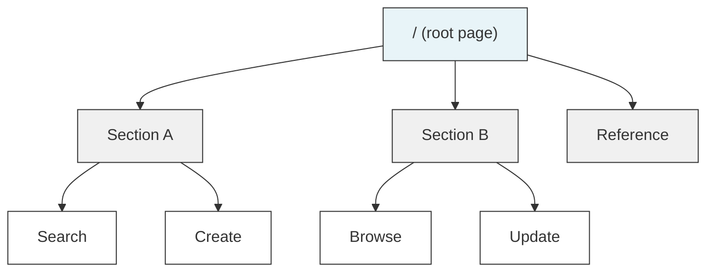
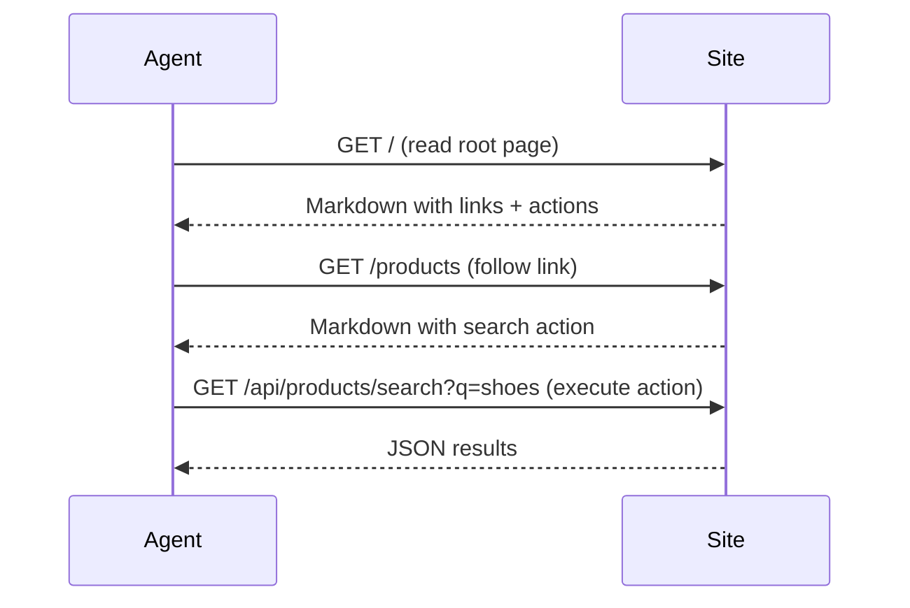
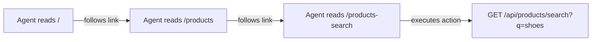

# MDH — Markdown Hypertext

MDH is a specification for building websites that AI agents can read, navigate, and interact with — using nothing but Markdown, YAML frontmatter, and plain HTTP.

## The problem

Agents interacting with the web today have bad options:

- **HTML scraping** is fragile. DOM structures change, CSS selectors break, and meaningful content is buried under layout markup.
- **OpenAPI specs** describe endpoints but not how to navigate a site, understand its content, or decide what to do next.
- **MCP** requires every site to run a protocol-specific server and every agent to implement a custom client.

MDH takes a different approach: describe your site as a graph of Markdown documents with YAML frontmatter that declares links, actions, and metadata. Agents navigate with standard HTTP GET requests and read plain text. No custom protocols, no DOM parsing, no tool schemas.

## How it works

Every page on an MDH site is a Markdown document with YAML frontmatter at the top. The frontmatter declares the page's identity, its relationships to other pages, and any actions (API calls) it describes. The body is natural Markdown prose — written for an agent to read and act on.



The flow: read the root page → follow links to sections of interest → find an action → call the API.



## Page structure

Every MDH page has two parts: **frontmatter** (structured metadata) and **body** (Markdown prose).

### Frontmatter

The frontmatter is YAML between `---` delimiters. It declares who the page is, what it links to, and what actions are available:

```yaml
---
id: products-search
type: page
title: Search Products
links:
  - rel: in_section
    target: products
    href: /products
  - rel: related_to
    target: categories
    href: /categories
actions:
  - id: products.search
    method: GET
    url: /api/products/search
    accept: application/json
    query:
      required: [q]
      optional: [category, min_price, max_price, limit, cursor]
---
```

**Required fields:**

| Field | Description |
|-------|-------------|
| `id` | Unique identifier for this page (e.g. `products-search`) |
| `type` | Page type — `section`, `page`, `reference`, `guide`, etc. |
| `title` | Human-readable title |

**Links** declare relationships to other pages. Each link has:

| Field | Description |
|-------|-------------|
| `rel` | Relationship type — `contains`, `in_section`, `related_to`, etc. |
| `target` | The target page's `id` |
| `href` | The URL path to the target page |

**Actions** declare callable HTTP endpoints. See [Actions](#actions) below.

### Body

The body is standard Markdown. Write it like you're explaining the page to someone who needs to understand it and do something with it. Use natural prose, include examples, and link to other pages with standard Markdown links:

```markdown
# Search Products

Find products by keyword. You can filter by category and price range —
see [categories](/categories) for the full list.

`GET /api/products/search?q=shoes&category=footwear&max_price=100`
```

The body and frontmatter work together. The frontmatter gives agents structured, parseable metadata. The body gives context, explanations, and examples that help agents understand *how* and *when* to use the actions.

## Content negotiation

MDH pages support multiple response formats based on the `Accept` header:

| Accept header | Response format |
|---------------|-----------------|
| `text/markdown` (or no header) | Raw Markdown with YAML frontmatter |
| `application/json` | Structured JSON with parsed frontmatter |
| `text/html` | Lightweight HTML rendering |

```bash
# Raw markdown (default)
curl https://example.com/products-search

# Structured JSON — useful for agents that want typed access to actions and links
curl -H "Accept: application/json" https://example.com/products-search

# HTML — for humans clicking around in a browser
curl -H "Accept: text/html" https://example.com/products-search
```

The JSON format returns the parsed frontmatter as structured data, making it easy for agents to extract actions, links, and metadata without parsing YAML:

```json
{
  "meta": {
    "id": "products-search",
    "type": "page",
    "title": "Search Products",
    "links": [
      { "rel": "in_section", "target": "products", "href": "/products" }
    ],
    "actions": [
      {
        "id": "products.search",
        "method": "GET",
        "url": "/api/products/search",
        "query": { "required": ["q"], "optional": ["category", "max_price"] }
      }
    ]
  },
  "body": "# Search Products\n\nFind products by keyword..."
}
```

## Actions

Actions are HTTP endpoints declared in a page's frontmatter. They tell agents exactly how to call an API — what method to use, what parameters are required, and what to expect back.

### GET-only actions (recommended for most agents)

The simplest and most compatible approach. All parameters go in the query string:

```yaml
action:
  id: orders.create
  method: GET
  url: /api/orders/create
  accept: application/json
  query:
    required:
      - product_id
      - name
    properties:
      product_id:
        type: string
        description: The product_id from a search result
      name:
        type: string
        description: "Customer full name (e.g. Alice Lindqvist)"
```

The agent calls it with a simple GET request:

```
GET /api/orders/create?product_id=prod_123&name=Alice+Lindqvist
```

This works with any agent that can make HTTP GET requests — which is all of them. For parameters that accept multiple values, the parameter is repeated:

```
GET /api/orders/create?product_id=prod_123&name=Alice+Lindqvist&name=Bob+Smith
```

### POST actions with request bodies

For more complex operations, actions can use POST with a JSON request body:

```yaml
action:
  id: orders.create
  method: POST
  url: /api/orders
  content_type: application/json
  accept: application/json
  body_schema:
    required:
      - product_id
      - customer
    properties:
      product_id:
        type: string
      customer:
        type: object
        required: [first_name, last_name, email]
        properties:
          first_name:
            type: string
          last_name:
            type: string
          email:
            type: string
```

The agent sends a POST with a JSON body:

```bash
curl -X POST https://example.com/api/orders \
  -H "Content-Type: application/json" \
  -d '{
    "product_id": "prod_123",
    "customer": {
      "first_name": "Alice",
      "last_name": "Lindqvist",
      "email": "alice@example.com"
    }
  }'
```

POST is the more natural fit for state-changing operations — it follows HTTP semantics correctly (GET should be safe and idempotent), supports structured request bodies, and handles complex nested data cleanly.

### GET vs POST: choosing an approach

| | GET-only | POST |
|---|----------|------|
| **Agent compatibility** | Works with all agents (webfetch, curl, any HTTP client) | Requires agents that can send request bodies |
| **Simplicity** | Parameters in URL, easy to construct | Needs JSON body construction |
| **Complex data** | Flat key-value pairs only; arrays via repeated params | Full JSON — nested objects, arrays of objects |
| **HTTP correctness** | Technically wrong for state-changing operations | Follows HTTP semantics properly |
| **Caching/safety** | GET requests may be cached or retried by intermediaries | POST signals "this changes state" |
| **Current agent support** | All agents today can do GET | Not all agents can send POST with custom bodies |

**Our recommendation:** Start with GET-only. Most AI agents today navigate the web using tools like `webfetch` that only support GET requests. Even agents with full HTTP access (like those using `curl`) find GET simpler to construct. You can always add POST support later when agent capabilities catch up.

### Supporting both

You can support GET and POST on the same endpoint. Declare both in the frontmatter and document both in the page body:

```yaml
action:
  id: orders.create
  title: Create Order
  methods:
    - method: GET
      url: /api/orders/create
      query:
        required: [product_id, name]
    - method: POST
      url: /api/orders
      content_type: application/json
      body_schema:
        required: [product_id, customer]
```

This lets agents use whichever approach they support.

## Navigation and discovery

Agents discover your site by starting at the root page and following links. There's no sitemap to fetch or index to crawl — just follow the links.

### The root page

The root page (`/`) is the entry point. It should give agents an overview of everything available and surface the most common actions directly:

```yaml
---
id: index
type: section
title: My Store
links:
  - rel: contains
    target: products
    href: /products
  - rel: contains
    target: orders
    href: /orders
  - rel: contains
    target: categories
    href: /categories
actions:
  - id: products.search
    method: GET
    url: /api/products/search
    query:
      required: [q]
      optional: [category, max_price, limit, cursor]
---
```

Putting the most common actions on the root page means agents can start searching immediately without navigating deeper. The links point to section pages with more detail.

### Following links

Every page links to related pages using standard Markdown links in the body and typed edges in the frontmatter. An agent reads a page, decides what it needs, and follows the relevant link:



### Link relationships

The `rel` field on frontmatter links helps agents understand the graph structure:

| Relationship | Meaning |
|-------------|---------|
| `contains` | Parent → child (section contains sub-pages) |
| `in_section` | Child → parent (page belongs to section) |
| `related_to` | Lateral connection (see also) |

## Best practices

### Write for agents, not humans

Your page body is what the agent reads to decide what to do. Be specific and concrete:

```markdown
# Search Products

Find products by keyword. Filter by category or price range —
see [categories](/categories) for all available categories.

`GET /api/products/search?q=shoes&max_price=100`

| Parameter | Required | Description |
|-----------|----------|-------------|
| q         | yes      | Search keyword |
| category  | no       | Category slug (e.g. footwear) |
| max_price | no       | Maximum price in USD |
```

Don't be vague. Show the exact endpoint, the exact parameters, and an example. The agent needs to construct a request — give it everything it needs on the page.

### Surface actions early

Put the most important actions on the root page. An agent shouldn't have to navigate through three levels of pages to find a search endpoint. The root page should include inline action definitions for the primary workflows.

### Use the root page as a landing page

The root page should explain what the site is and what you can do on it. Think of it as a homepage that orients the agent:

- What is this site?
- What are the main sections?
- What are the key actions and how do I call them?
- What reference data is available?

### Keep pages focused

Each page should cover one topic or one action. Don't put product search and order creation on the same page. Split them so agents can navigate to exactly what they need.

### Link generously

When you mention another page's topic, link to it. This is how agents navigate — they follow links to find what they need. A page about creating an order should link to the product search, the categories reference, and the orders overview.

### Include agent guidelines for sensitive actions

For actions that change state (orders, payments, account changes), include explicit guidance for the agent:

```markdown
## Important: confirm with the user first

Before placing this order, always show the user a summary of what will
be ordered — the product, quantity, price, and shipping address. Only
proceed after the user confirms.
```

This sets behavioral expectations that well-built agents will follow.

### Don't duplicate content

If categories are listed on the categories page, link to it rather than copying the list onto every other page. Keep information in one place and link to it.

## Pagination

For endpoints that return lists, use cursor-based pagination. Declare the pagination contract in the action's frontmatter:

```yaml
actions:
  - id: products.search
    method: GET
    url: /api/products/search
    pagination:
      type: cursor
      request:
        cursor_param: cursor
        limit_param: limit
      response:
        next_cursor_jsonpath: "$.next_cursor"
```

Responses include a cursor for the next page:

```json
{
  "results": [...],
  "total": 42,
  "next_cursor": "prod_abc123"
}
```

When `next_cursor` is `null`, there are no more results. The agent passes the cursor value back as a query parameter to get the next page.

## Security

A key reason most AI agents today are limited to read-only `webfetch` tools — and can't freely run `curl`, send POST requests, or execute arbitrary HTTP calls — is security.

### Why agents can't just curl anything

Giving an agent unrestricted HTTP access opens the door to serious risks:

- **Prompt injection.** A malicious website could embed instructions in its content that trick the agent into making unintended requests — sending data to attacker-controlled servers, calling APIs with harmful parameters, or leaking sensitive information from the conversation context.
- **Data exfiltration.** An agent with full HTTP access could be manipulated into sending private data (API keys, user details, conversation contents) to external endpoints via query parameters or request bodies.
- **Unintended side effects.** POST, PUT, and DELETE requests change state. An agent that misinterprets a page — or gets tricked by injected instructions — could create orders, modify accounts, delete data, or trigger payments without the user's intent.
- **SSRF (Server-Side Request Forgery).** If an agent runs in a server environment, unrestricted HTTP access could let it probe internal networks, access metadata endpoints, or reach services that should never be publicly accessible.

This is why agent frameworks restrict HTTP tools to GET-only, require user confirmation for state-changing actions, or sandbox network access entirely. The restrictions aren't a temporary limitation — they're a deliberate security boundary.

### How MDH works within these constraints

MDH is designed with this reality in mind:

- **Navigation is read-only.** All page discovery and content reading uses plain GET requests. An agent with nothing but `webfetch` can fully navigate an MDH site, read every page, understand the graph structure, and discover all available actions.
- **Actions are explicit.** Rather than hoping agents will figure out how to interact with a site, MDH declares actions in structured frontmatter. The agent knows exactly what endpoint to call, what parameters are needed, and what the action does — reducing the chance of misinterpreting content or following injected instructions.
- **Confirmation guidance is embedded.** MDH pages can include explicit behavioral guidance ("confirm with the user before ordering"). Well-built agents follow these instructions, keeping the human in the loop for anything that changes state.
- **GET-only actions are a pragmatic option.** For sites that want maximum agent compatibility today, actions can be exposed as GET endpoints with query parameters. This lets agents execute actions using only their existing `webfetch` tool, while the page content and confirmation guidance provide the safety layer.

### Looking ahead

As agent security models mature — with better sandboxing, permission scoping, and prompt injection defenses — more agents will gain the ability to make POST requests and send custom headers safely. When that happens, MDH sites can adopt POST for state-changing actions (which is the correct HTTP approach) without changing anything about how navigation and discovery work. The spec supports both today.

## Comparison

| | MDH | HTML scraping | OpenAPI | MCP |
|---|---------|--------------|---------|-----|
| Content format | Markdown | HTML | JSON Schema | Protocol-specific |
| Site structure | Frontmatter links | Implicit in DOM | Not modeled | Not modeled |
| Navigation | Follow Markdown links | Parse HTML, guess | Not supported | Not supported |
| Actions | Declared in YAML frontmatter | Reverse-engineered | Declared in YAML/JSON | Tool definitions |
| Content | Natural prose for agents | Markup for humans | Parameter descriptions | Tool descriptions |
| Transport | Plain HTTP | HTTP | HTTP | Custom protocol |
| Server requirements | Serve Markdown files | None | None | MCP server |
| Agent requirements | HTTP GET + read text | Parse HTML + heuristics | Parse OpenAPI schema | MCP client |

## Example

See the [example/](example/) directory for a complete working MDH site — a travel search app with flights, hotels, and bookings. It includes 11 Markdown pages, search and booking APIs, content negotiation, and pagination. A live demo is at [markdown-hypertext-example.vercel.app](https://markdown-hypertext-example.vercel.app).

## Project

- [Specification](SPEC.md) — the full MDH 1.0 spec
- [Implementation guide](GUIDE.md) — how to build an MDH site
- [Example site](example/) — working travel search site with MDH
