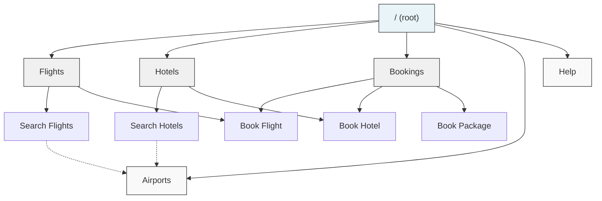

# Wayfare (Example MDH Site)

A travel search site built with [MDH](../README.md). 15 cities across Europe and North America. Flights, hotels, and bookings, all through GET requests.

Live: [markdown-hypertext-example.vercel.app](https://markdown-hypertext-example.vercel.app)

## Why GET-only

Every endpoint in this example uses GET, including bookings. Normally you'd use POST for state-changing operations, but most AI agents today only have `webfetch` or similar read-only tools. Using GET everywhere means any agent can use every feature on the site without needing special HTTP capabilities.

Passenger and guest names go in query parameters:

```
GET /api/flights/book?offer_id=off_arn_lhr_1&passenger=Alice+Lindqvist
```

Multiple values use repeated parameters:

```
GET /api/flights/book?offer_id=off_arn_lhr_1&passenger=Alice+Lindqvist&passenger=Bob+Smith
```

See the main README's [GET vs POST section](../README.md#get-vs-post-choosing-an-approach) for trade-offs.

## Running locally

```bash
npm install
npm run dev
```

Starts at `http://localhost:3000`.

## Try the discovery flow

This is how an agent would work through the site:

```bash
# Read the root page
curl http://localhost:3000/

# Go to the flights section
curl http://localhost:3000/flights

# Read the search docs
curl http://localhost:3000/flights-search

# Search Stockholm to London
curl "http://localhost:3000/api/flights/search?from=ARN&to=LHR"

# Same search, specific date
curl "http://localhost:3000/api/flights/search?from=ARN&to=LHR&date=2026-03-10"

# Look at one offer
curl http://localhost:3000/api/flights/offers/off_arn_lhr_1

# Book it
curl "http://localhost:3000/api/flights/book?offer_id=off_arn_lhr_1&passenger=Alice+Lindqvist"

# Check the booking
curl http://localhost:3000/api/bookings/bkg_f_1
```

## Content negotiation

Every page responds differently based on the `Accept` header:

```bash
# Markdown (default)
curl http://localhost:3000/flights-search

# JSON with parsed frontmatter
curl -H "Accept: application/json" http://localhost:3000/flights-search

# HTML with clickable links
curl -H "Accept: text/html" http://localhost:3000/flights-search
```

## Site graph



Solid lines are `contains`/`in_section` relationships. Dotted lines are `related_to`.

## Pages

| Page | Type | What it covers |
|------|------|----------------|
| `/` | section | Site overview, key actions, airport codes |
| `/flights` | section | Flights overview, routes, examples |
| `/flights-search` | page | Flight search parameters, pagination |
| `/flights-book` | page | Booking a flight (asks agent to confirm with user) |
| `/hotels` | section | Hotels overview, search examples |
| `/hotels-search` | page | Hotel search parameters, filters |
| `/hotels-book` | page | Booking a hotel (asks agent to confirm with user) |
| `/bookings` | section | Booking types, lookup, flow |
| `/package-book` | page | Flight + hotel in one booking (asks agent to confirm) |
| `/airports` | reference | All 15 airport codes |
| `/help` | guide | Getting started walkthrough |

## API endpoints

### Search

| Endpoint | What it does |
|----------|-------------|
| `GET /api/flights/search?from=ARN&to=LHR` | Search flights between two cities |
| `GET /api/hotels/search?city=LHR` | Search hotels in a city |
| `GET /api/flights/offers/{offer_id}` | Full details of a flight offer |
| `GET /api/hotels/{hotel_id}` | Full details of a hotel |

### Booking

| Endpoint | What it does |
|----------|-------------|
| `GET /api/flights/book?offer_id=...&passenger=...` | Book a flight |
| `GET /api/hotels/book?hotel_id=...&room_type=...&checkin=...&checkout=...&guest=...` | Book a hotel |
| `GET /api/bookings/package?offer_id=...&hotel_id=...&room_type=...&checkin=...&checkout=...&passenger=...` | Book flight + hotel together |
| `GET /api/bookings/{booking_id}` | Look up a booking |

### Flight search parameters

| Parameter | Required | Description |
|-----------|----------|-------------|
| `from` | yes | Departure airport code (e.g. ARN) |
| `to` | yes | Arrival airport code (e.g. LHR) |
| `date` | no | Travel date (YYYY-MM-DD) |
| `cabin` | no | `economy` or `business` |
| `max_price` | no | Maximum price in EUR |
| `limit` | no | Results per page (default 10, max 50) |
| `cursor` | no | Pagination cursor |

### Hotel search parameters

| Parameter | Required | Description |
|-----------|----------|-------------|
| `city` | yes | City airport code (e.g. LHR) |
| `checkin` | no | Check-in date (YYYY-MM-DD) |
| `checkout` | no | Check-out date (YYYY-MM-DD) |
| `min_stars` | no | Minimum star rating (2-5) |
| `max_price` | no | Max price per night in EUR |
| `guests` | no | Number of guests |
| `limit` | no | Results per page (default 10, max 50) |
| `cursor` | no | Pagination cursor |

## Airport codes

| Code | City | Code | City | Code | City |
|------|------|------|------|------|------|
| ARN | Stockholm | LHR | London | CDG | Paris |
| AMS | Amsterdam | FRA | Frankfurt | BCN | Barcelona |
| MAD | Madrid | FCO | Rome | BER | Berlin |
| CPH | Copenhagen | OSL | Oslo | HEL | Helsinki |
| VIE | Vienna | ZRH | Zurich | JFK | New York |

## Date behavior

Search results change slightly depending on the date you request:

- Odd days (1st, 3rd, 5th...): original prices, normal sort
- Even days (2nd, 4th, 6th...): 15% price bump, reversed sort

This fakes price variation without a live pricing engine.

## Project structure

```
├── content/md/          # Markdown pages (11 files)
├── data/
│   ├── flights.json     # Flight offers for all routes
│   └── hotels.json      # Hotel listings for all cities
├── app/
│   ├── route.js         # Root page (/)
│   ├── [node]/route.js  # Dynamic page handler
│   └── api/
│       ├── flights/search/route.js
│       ├── flights/book/route.js
│       ├── flights/offers/[id]/route.js
│       ├── hotels/search/route.js
│       ├── hotels/book/route.js
│       ├── hotels/[id]/route.js
│       ├── bookings/[id]/route.js
│       └── bookings/package/route.js
└── lib/
    ├── content.js       # Reads markdown, parses frontmatter, renders HTML
    └── bookings.js      # In-memory booking store
```

## Notes

- Bookings live in memory and reset on server restart
- All prices are in EUR
- Every city connects to every other city for flights
- Each city has 5 hotels across different star ratings
