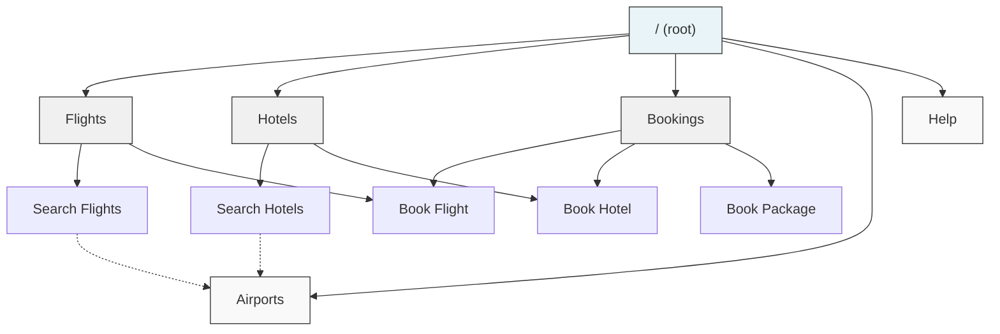

# Wayfare — Example MDH Site

Wayfare is a travel search site built with [MDH (Markdown Hypertext)](../README.md). It covers 15 cities across Europe and North America with flight search, hotel search, and booking — all navigable by AI agents using plain HTTP GET requests.

Live demo: [markdown-hypertext-example.vercel.app](https://markdown-hypertext-example.vercel.app)

## GET-only approach

This example uses GET requests exclusively — including for booking actions that would traditionally use POST. This is a deliberate choice to demonstrate maximum compatibility with current AI agents, most of which only have access to `webfetch` or equivalent GET-only tools.

Booking parameters like passenger names are passed as query parameters:

```
GET /api/flights/book?offer_id=off_arn_lhr_1&passenger=Alice+Lindqvist
```

For multiple values, repeat the parameter:

```
GET /api/flights/book?offer_id=off_arn_lhr_1&passenger=Alice+Lindqvist&passenger=Bob+Smith
```

See the main README's [GET vs POST section](../README.md#get-vs-post-choosing-an-approach) for the trade-offs of this approach.

## Running locally

```bash
npm install
npm run dev
```

The site starts at `http://localhost:3000`.

## Discovery flow

Walk through how an agent would navigate the site:

```bash
# 1. Read the root page — see what's available
curl http://localhost:3000/

# 2. Navigate to the flights section
curl http://localhost:3000/flights

# 3. Read the search page — learn how to search
curl http://localhost:3000/flights-search

# 4. Search for flights from Stockholm to London
curl "http://localhost:3000/api/flights/search?from=ARN&to=LHR"

# 5. Search with a specific date
curl "http://localhost:3000/api/flights/search?from=ARN&to=LHR&date=2026-03-10"

# 6. Get details on a specific offer
curl http://localhost:3000/api/flights/offers/off_arn_lhr_1

# 7. Book a flight
curl "http://localhost:3000/api/flights/book?offer_id=off_arn_lhr_1&passenger=Alice+Lindqvist"

# 8. Look up the booking
curl http://localhost:3000/api/bookings/bkg_f_1
```

## Content negotiation

Every page supports three response formats:

```bash
# Raw markdown with YAML frontmatter (default)
curl http://localhost:3000/flights-search

# Structured JSON — parsed frontmatter + body
curl -H "Accept: application/json" http://localhost:3000/flights-search

# Lightweight HTML — raw markdown with clickable links
curl -H "Accept: text/html" http://localhost:3000/flights-search
```

## Site graph



Solid lines = `contains` / `in_section` relationships. Dotted lines = `related_to`.

## Pages

| Page | Type | Description |
|------|------|-------------|
| `/` | section | Root page — site overview, key actions, airport codes |
| `/flights` | section | Flights overview with routes and example searches |
| `/flights-search` | page | How to search flights — parameters, pagination, examples |
| `/flights-book` | page | How to book a flight — requires user confirmation |
| `/hotels` | section | Hotels overview with search examples |
| `/hotels-search` | page | How to search hotels — parameters, filters, examples |
| `/hotels-book` | page | How to book a hotel — requires user confirmation |
| `/bookings` | section | Bookings overview — types, lookup, booking flow |
| `/package-book` | page | Book flight + hotel together — requires user confirmation |
| `/airports` | reference | All 15 airport codes and city names |
| `/help` | guide | Getting started walkthrough |

## API endpoints

### Search

| Endpoint | Description |
|----------|-------------|
| `GET /api/flights/search?from=ARN&to=LHR` | Search flights between two cities |
| `GET /api/hotels/search?city=LHR` | Search hotels in a city |
| `GET /api/flights/offers/{offer_id}` | Get full details of a flight offer |
| `GET /api/hotels/{hotel_id}` | Get full details of a hotel |

### Booking

| Endpoint | Description |
|----------|-------------|
| `GET /api/flights/book?offer_id=...&passenger=...` | Book a flight |
| `GET /api/hotels/book?hotel_id=...&room_type=...&checkin=...&checkout=...&guest=...` | Book a hotel |
| `GET /api/bookings/package?offer_id=...&hotel_id=...&room_type=...&checkin=...&checkout=...&passenger=...` | Book flight + hotel together |
| `GET /api/bookings/{booking_id}` | Look up a booking |

### Search parameters

**Flights:**

| Parameter | Required | Description |
|-----------|----------|-------------|
| `from` | yes | Departure airport code (e.g. ARN) |
| `to` | yes | Arrival airport code (e.g. LHR) |
| `date` | no | Travel date (YYYY-MM-DD) |
| `cabin` | no | `economy` or `business` |
| `max_price` | no | Maximum price in EUR |
| `limit` | no | Results per page (default 10, max 50) |
| `cursor` | no | Pagination cursor |

**Hotels:**

| Parameter | Required | Description |
|-----------|----------|-------------|
| `city` | yes | City airport code (e.g. LHR) |
| `checkin` | no | Check-in date (YYYY-MM-DD) |
| `checkout` | no | Check-out date (YYYY-MM-DD) |
| `min_stars` | no | Minimum star rating (2–5) |
| `max_price` | no | Max price per night in EUR |
| `guests` | no | Number of guests |
| `limit` | no | Results per page (default 10, max 50) |
| `cursor` | no | Pagination cursor |

## Airport codes

| Code | City | Code | City | Code | City |
|------|------|------|------|------|------|
| ARN | Stockholm | LHR | London | CDG | Paris |
| AMS | Amsterdam | FRA | Frankfurt | BCN | Barcelona |
| MAD | Madrid | FCO | Rome | BER | Berlin |
| CPH | Copenhagen | OSL | Oslo | HEL | Helsinki |
| VIE | Vienna | ZRH | Zurich | JFK | New York |

## Date behavior

Search results vary slightly based on the requested date:

- **Odd days** (1st, 3rd, 5th...): original prices, normal sort order
- **Even days** (2nd, 4th, 6th...): 15% price increase, reversed sort order

This simulates real-world price variation without needing a live pricing engine.

## Project structure

```
├── content/md/          # Markdown pages (11 files)
├── data/                # Static data
│   ├── flights.json     # Flight offers (all routes)
│   └── hotels.json      # Hotel listings (all cities)
├── app/                 # Next.js route handlers
│   ├── route.js         # Root page (/)
│   ├── [node]/route.js  # Dynamic page handler
│   └── api/             # API endpoints
│       ├── flights/search/route.js
│       ├── flights/book/route.js
│       ├── flights/offers/[id]/route.js
│       ├── hotels/search/route.js
│       ├── hotels/book/route.js
│       ├── hotels/[id]/route.js
│       ├── bookings/[id]/route.js
│       └── bookings/package/route.js
└── lib/
    ├── content.js       # Markdown reading, frontmatter parsing, HTML rendering
    └── bookings.js      # In-memory booking store
```

## Notes

- Bookings are stored in memory and reset when the server restarts.
- All prices are in EUR.
- Every city connects to every other city for flights.
- Each city has 5 hotels with varying star ratings and room types.
